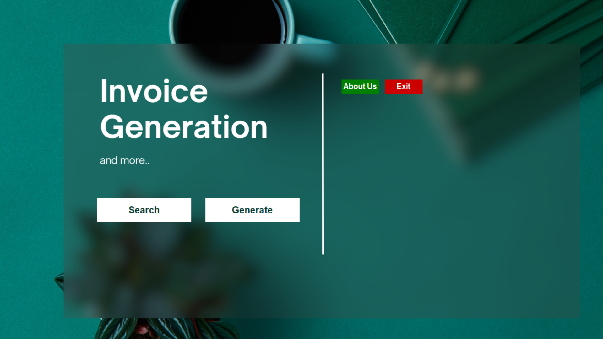
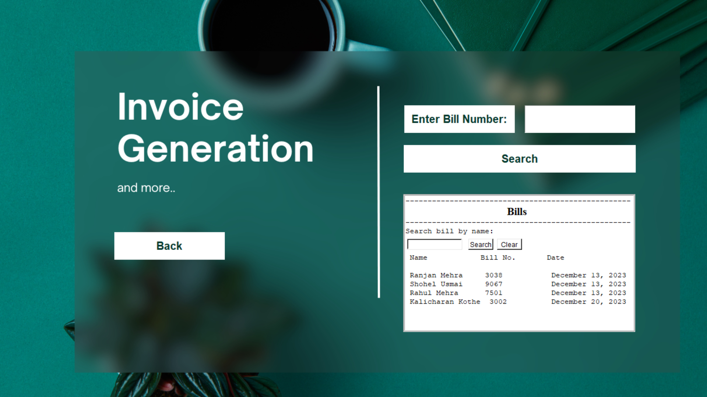
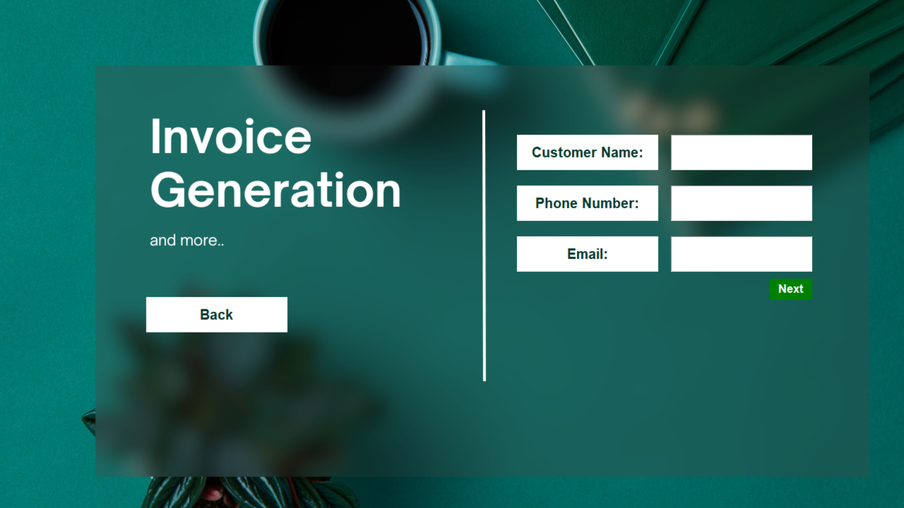
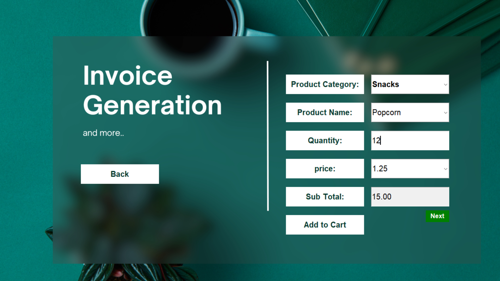

# Grocery Billing System

## Overview

The Grocery Billing System is a simple GUI-based program developed in Python using the tkinter library. This program allows users to generate bills for customers in a shop or supermarket. It provides functionalities to search for existing bills by their numbers, generate new bills, and save bill details to a MySQL database.

## Features

- **Search Bill:** Users can search for existing bills by entering the bill number. The program displays the details of the searched bill.
  
- **Generate Bill:** Users can generate a new bill by entering customer details, selecting products, and specifying quantities. The program calculates the total price and displays a summary of the bill.
  
- **Save Bill:** Users have the option to save the generated bill to a text file for future reference.
  
- **Print Bill:** Users can print the details of the searched or generated bill.
  
- **About Us:** Provides information about the program and its purpose.

## Screenshots

1. Main Screen with options to search and generate bills.
   

2. Search Bill screen with the option to enter a bill number.
   

3. Generate Bill screen for entering customer details.
   

4. Generate Bill screen for entering product information.
   

## Prerequisites
Before running the program, make sure you have the following dependencies installed:

- Python (3.x recommended)
- tkinter library
- mysql-connector-python library
- PIL library (Pillow)

Install the required libraries using the following command:
```bash
pip install -r requrirements.txt
```
## Database Setup
The project relies on a MySQL database to store bill-related information. Follow the steps below to import the required schema into your MySQL database.

### Using MySQL Command-Line Client:

1. Open a Command Prompt or Terminal.

2. Navigate to the 'Database' folder containing the SQL files (grocery_billing_system_bills.sql and grocery_billing_system_products.sql). Use the `cd` command to change directories.
   ```bash
   cd path/to/folder
   ```
3. Run the MySQL command to import the schema:
    ```bash
   mysql -u your_username -p your_database_name < grocery_billing_system_bills.sql
   ```
   ```bash
   mysql -u your_username -p your_database_name < grocery_billing_system_products.sql
   ```
   Replace your_username and your_database_name with the appropriate values. You will be prompted to enter your MySQL password.

### Using MySQL Workbench:

1. Open MySQL Workbench and connect to your MySQL server.

2. Navigate to "Server" > "Data Import" from the top menu.

3. Choose "Import from Self-Contained File" and select the SQL file (schema.sql) containing the schema.

4. Specify the target schema where you want to import the data. MySQL Workbench can create it if it doesn't exist.

5. Click the "Start Import" button to begin the import process.

6. Monitor the progress in the Output panel at the bottom of MySQL Workbench. Upon completion, you should see a success message.

7. Verify the imported schema using MySQL Workbench or another MySQL client to connect to the database.

## Installation and Running the Application
1. Clone the repository:
    ```bash
    git clone https://github.com/MehraYash524/GUI-InvoiceGenerationSystem.git
    ```
2. Navigate to the project directory:
    ```bash
    cd GUI-InvoiceGenerationSystem
    ```

3. To run the Grocery Billing System, execute the main Python script:
    ```bash
    python main.py
    ```

## Usage
1. Launch the program and choose to either search for an existing bill or generate a new one.

2. For generating a new bill, enter customer details, select products, and specify quantities. Click "Add to Cart" to add items to the bill.

3. Click "Next" to view the bill summary, and then choose to save or print the bill.

4. For searching an existing bill, enter the bill number and click "Search."

**Contributions are always welcome!**